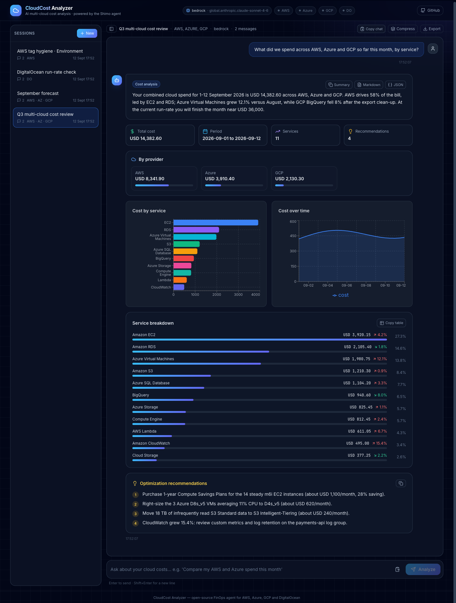
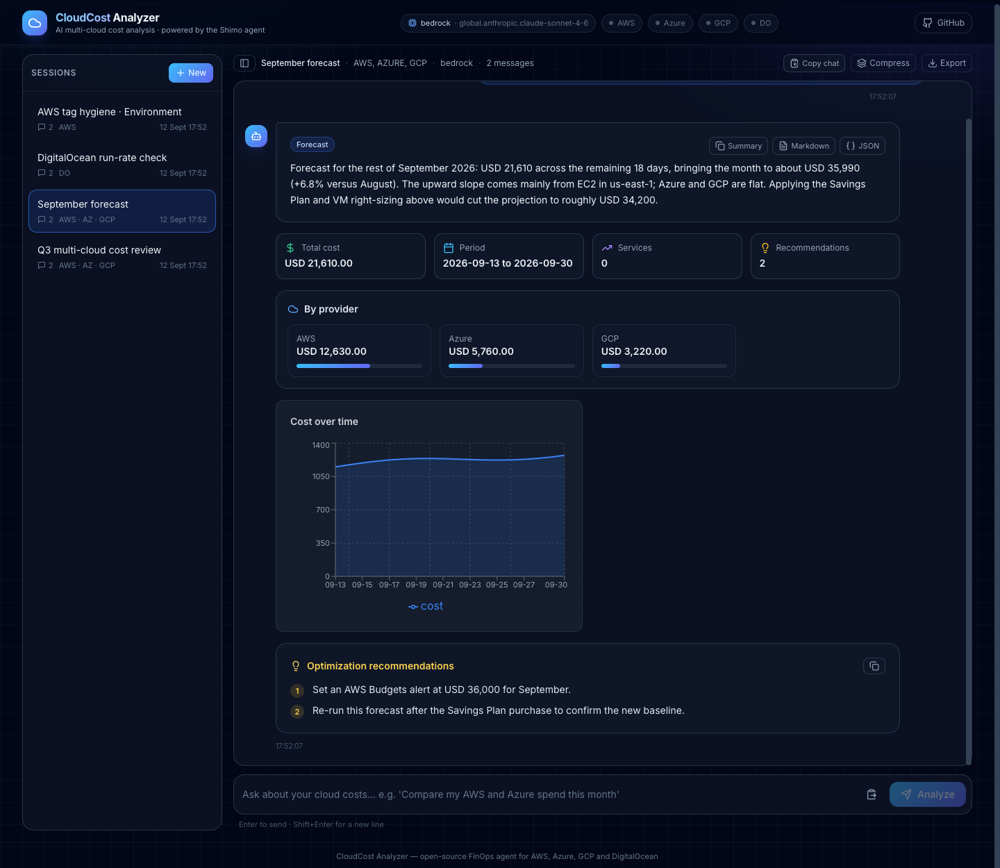
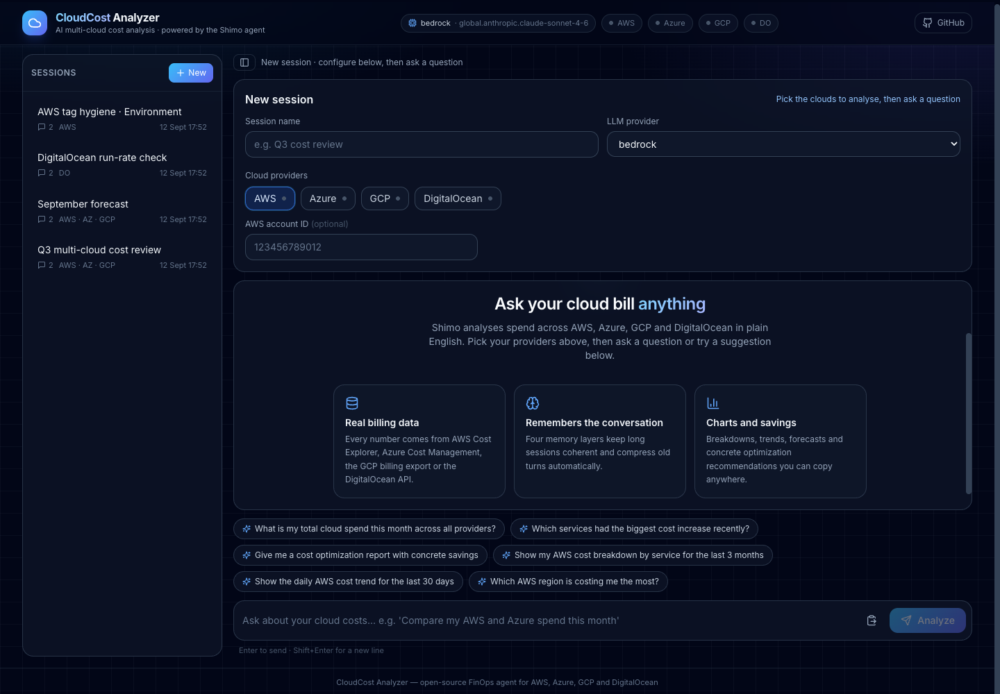
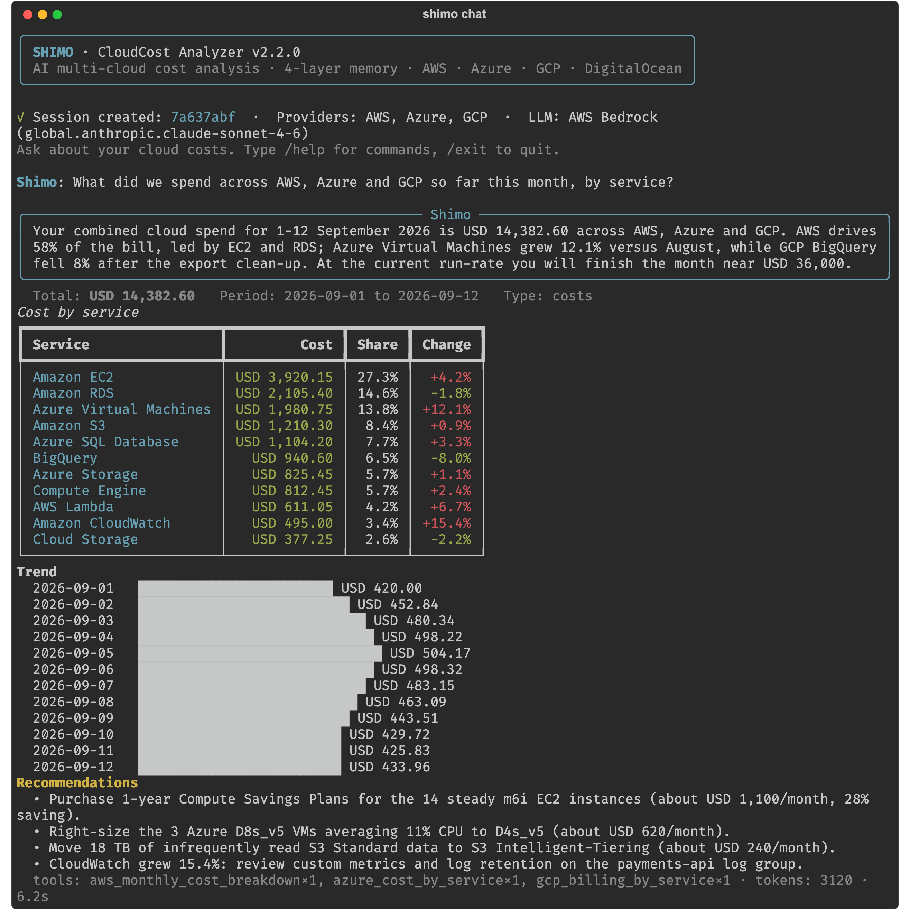
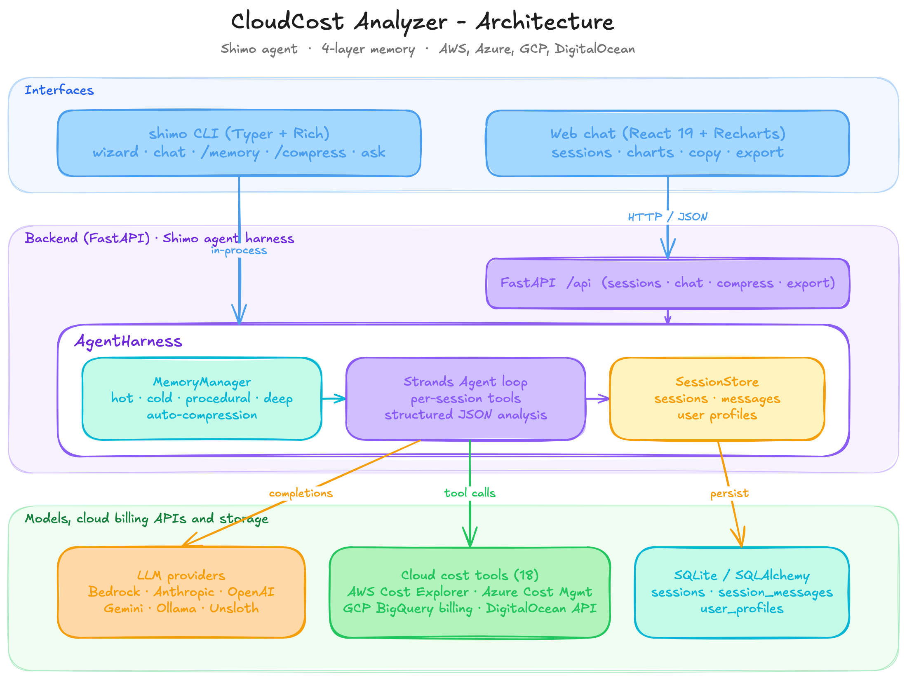

# CloudCost Analyzer - AI Multi-Cloud Cost Analysis & FinOps Agent

> **Natural-language cloud cost analysis for AWS, Azure, GCP and DigitalOcean.** Ask *"what did I spend on EC2 this month?"* or *"compare my Azure and GCP bills and tell me where to save"* and get real numbers from your billing APIs, charts, trends, forecasts and optimization recommendations. Powered by **Shimo**, a memory-aware AI agent, available as a CLI (`shimo`) and a web chat.

    [](LICENSE) 

**Keywords:** cloud cost analyzer · FinOps · AWS Cost Explorer · Azure Cost Management · GCP billing export · DigitalOcean billing · multi-cloud cost optimization · AI agent · LLM · Bedrock · Claude · OpenAI · Gemini · Ollama

## Screenshots

<p align="center">
  
</p>
<p align="center"><em>Web chat: multi-cloud cost breakdown across AWS, Azure and GCP with per-provider totals, charts, service table and copyable recommendations.</em></p>

<table>
  <tr>
    <td width="50%"></td>
    <td width="50%"></td>
  </tr>
  <tr>
    <td align="center"><em>Forecast turn with time-series chart</em></td>
    <td align="center"><em>New session: pick providers, accounts and LLM</em></td>
  </tr>
</table>

<p align="center">
  
</p>
<p align="center"><em>The <code>shimo</code> CLI: same agent, same memory, rendered with Rich in the terminal.</em></p>

## Table of contents

- [Screenshots](#screenshots)
- [Why CloudCost Analyzer](#why-cloudcost-analyzer)
- [Features](#features)
- [Architecture](#architecture)
- [Quick start](#quick-start)
- [CLI (`shimo`)](#cli)
- [Web chat](#web-chat)
- [API](#api)
- [Configuration](#configuration)
- [Project structure](#project-structure)
- [Development](#development)
- [FAQ](#faq)
- [Security notes](#security-notes)

## Why CloudCost Analyzer

Cloud bills are spread across four consoles, dozens of services and thousands of line items. CloudCost Analyzer turns that into a conversation:

| You ask | Shimo does |
|---|---|
| "What is my AWS spend this month by service?" | Calls Cost Explorer, returns a ranked breakdown with shares and a chart |
| "Show the daily GCP cost trend for the last 30 days" | Queries the BigQuery billing export and plots the trend |
| "Compare Azure and DigitalOcean costs" | Pulls both providers and produces per-provider totals |
| "Forecast next month and tell me where to save" | Uses the cost forecast API and returns concrete recommendations |

Sessions are persisted, resumable and compressed automatically, so a month-long cost review stays coherent.

## Features

**Cloud providers (18 tools)**
- **AWS** - Cost Explorer breakdowns (service, region, account, tag, usage type), daily trend, forecast, resource inventory (EC2, RDS, S3, Lambda)
- **Azure** - Cost Management by service, daily trend, resource inventory (service principal or `az login`)
- **GCP** - BigQuery billing export by service and by day, Cloud Billing account info, Cloud Asset inventory (service account or ADC)
- **DigitalOcean** - balance and invoices, monthly trend, resource run-rate estimate

**Shimo agent harness**
- Strands Agents loop with per-session tools: only the providers enabled for a session are exposed to the model
- Structured JSON answers (summary, totals, per-provider totals, service breakdown, time series, recommendations, chart hint) rendered as charts in the web UI and tables in the CLI
- Graceful failures: tool errors are reported in the answer, model outages are recorded as an error turn instead of crashing
- 6 LLM back-ends: Bedrock, Anthropic, OpenAI, Gemini, Ollama, Unsloth Studio (with Gemini fallback)

**4-layer memory (persisted)**
- **Hot** - session metadata, connected accounts and the last few turns, injected into every prompt
- **Cold** - searchable history hydrated from the database on resume; relevant earlier turns are recalled into the prompt
- **Procedural** - built-in cost-analysis skills loaded on demand for the current question
- **Deep** - optional cross-session user profile (topics, providers, preferences) stored per user id
- Automatic **context compression**: once a session grows past a threshold, older turns are summarised (by the LLM, with an extractive fallback) and the summary is persisted

**Interfaces**
- **CLI** (`shimo`) - setup wizard, interactive chat with `/memory`, `/compress`, `/export`, one-shot `shimo ask`, session management
- **Web chat** - React 19 + Recharts; sessions sidebar, resume with full history, provider/LLM setup, compress and export, one-click copy of answers, tables, JSON and whole conversations as Markdown
- **REST API** - sessions, chat, messages, analysis cache, compression, export, provider status

## Architecture

<p align="center">
  
</p>
<p align="center"><em>Editable source: <a href="docs/architecture.excalidraw">docs/architecture.excalidraw</a> (open at excalidraw.com) · <a href="docs/architecture.svg">SVG</a></em></p>

Every query goes through the same path: memory assembles the prompt (system rules + connected accounts + recalled history + skills), the agent calls tools and answers in JSON, the harness normalises the answer, records it in memory and the database, and compresses history when needed.

## Quick start

### Prerequisites
- Docker and Docker Compose, **or** Python 3.10+ ([uv](https://docs.astral.sh/uv/) recommended) and Node 20+
- Credentials for at least one cloud provider
- An LLM: Bedrock access, or an Anthropic/OpenAI/Gemini key, or a local Ollama

### 1. Configure

```bash
git clone https://github.com/Faizullah9181/cloudcost-analyzer.git cloudcost-analyzer
cd cloudcost-analyzer
cp .env.example .env      # then edit .env
```

Minimal `.env` for AWS + Bedrock:

```env
AWS_ACCESS_KEY_ID=...            # or leave empty and use AWS_PROFILE / instance role
AWS_SECRET_ACCESS_KEY=...
AWS_DEFAULT_REGION=us-east-1
LLM_PROVIDER=bedrock
BEDROCK_MODEL_ID=global.anthropic.claude-sonnet-4-6
BEDROCK_REGION=us-west-2
```

Use `LLM_PROVIDER=anthropic` with `ANTHROPIC_API_KEY` (model `claude-opus-5` by default), `openai`, `gemini`, `ollama` or `unsloth`. See `.env.example` for every option.

### 2. Run with Docker

```bash
docker compose up --build
```

- Web chat: http://localhost:5035
- API docs: http://localhost:8001/docs
- CLI inside the container: `docker compose exec -it backend shimo chat`

The SQLite database lives in `./data/shimo.db` (bind-mounted).

### 3. Run locally

```bash
# backend (from the repo root)
uv sync --extra dev                    # or: python -m venv .venv && pip install -e ".[dev]"
uv run uvicorn backend.main:app --reload --port 8000

# frontend (another terminal)
cd frontend && npm install && npm run dev      # http://localhost:5173, proxies /api to :8000

# CLI
uv run shimo chat
```

## CLI

The CLI is called `shimo`, after the agent.

```
$ shimo chat
╭──────────────────────────────────────────────────╮
│ SHIMO · CloudCost Analyzer v2.2.0                │
╰──────────────────────────────────────────────────╯
Session name [Session 2025-09-10 14:02]: Q3 review
Step 1 · Cloud providers
  1 - AWS            configured
  2 - Azure          not configured
  ...
Select providers [1]: 1,4
Step 2 · Account context   (identifiers are saved; secrets are never written to disk)
Step 3 · LLM provider
✓ Session created: 4f1c...

Shimo> What did I spend on AWS this month by service?
╭─ Shimo ─────────────────────────────────────────╮
│ Your AWS spend for September so far is USD ...  │
╰─────────────────────────────────────────────────╯
  Total: USD 1,234.56   Period: 2025-09-01 to 2025-09-10   Type: costs
  Cost by service  ...
  tools: aws_monthly_cost_breakdown×1 · tokens: 3120 · 6.2s
```

| Command | Description |
|---------|-------------|
| `shimo chat` | Wizard, then interactive chat. `--session ID` resumes; `--quick -p aws,gcp -l anthropic` skips the wizard |
| `shimo ask "question" [--session ID] [--json]` | One-shot question (scriptable) |
| `shimo new` | Create a session without chatting |
| `shimo sessions [--all]` | List sessions |
| `shimo resume ID` | Resume a session |
| `shimo export ID [-o file.json]` | Export messages, analysis and memory snapshot |
| `shimo delete ID [--hard] [-y]` | Archive (or permanently delete) a session |
| `shimo providers` / `shimo config` | Show provider configuration and effective settings |

In-chat commands: `/help`, `/sessions`, `/session`, `/memory`, `/health`, `/tools`, `/compress`, `/export [file]`, `/config`, `/clouds`, `/model`, `/exit`.

Secrets entered in the wizard (API tokens, access keys) are applied to the running process only. Account identifiers (account id, subscription id, project id, region) are stored with the session so the agent passes them to tools.

## Web chat

1. Open the UI, pick the providers to analyse, optionally enter account identifiers, choose the LLM.
2. Ask a question. The first message creates a session; every turn is persisted.
3. Switch sessions in the sidebar to resume with full history; use **Compress** to summarise a long session, **Export** to download it and **Copy chat** to copy the whole conversation as Markdown.
4. Every answer has copy buttons for the summary, a Markdown report, the service table and the raw analysis JSON. The input supports Enter to send, Shift+Enter for new lines and paste-from-clipboard.

## API

```
GET    /api/health                      service + LLM info
GET    /api/providers                   configured providers and their tools
GET    /api/stats                       counters
GET    /api/suggestions                 example questions
POST   /api/analyze                     {query, session_id?} - stateless when no session_id

POST   /api/sessions                    {name, cloud_providers, llm_provider?, connection_context?, user_id?}
GET    /api/sessions?include_archived=  list
GET    /api/sessions/{id}               (id prefix of 6+ chars accepted)
PATCH  /api/sessions/{id}               rename / update context / tags
DELETE /api/sessions/{id}?hard=         archive or delete
POST   /api/sessions/{id}/chat          {query} -> answer, analysis, tool calls, memory info
GET    /api/sessions/{id}/messages      history
POST   /api/sessions/{id}/messages      add a message manually
GET    /api/sessions/{id}/analysis      last analysis   (POST replaces it)
POST   /api/sessions/{id}/compress      summarise older turns
GET    /api/sessions/{id}/export        full export
GET    /api/sessions/{id}/memory        memory-layer status
```

Interactive docs: `/docs`.

## Configuration

All settings come from environment variables or `.env` (repository root). Key ones:

| Variable | Purpose | Default |
|----------|---------|---------|
| `LLM_PROVIDER` | `bedrock`, `anthropic`, `openai`, `gemini`, `ollama`, `unsloth` | `bedrock` |
| `BEDROCK_MODEL_ID` / `BEDROCK_REGION` | Bedrock model and region | `global.anthropic.claude-sonnet-4-6` / `us-west-2` |
| `ANTHROPIC_API_KEY` / `ANTHROPIC_MODEL` | Anthropic API | - / `claude-opus-5` |
| `OPENAI_API_KEY` / `OPENAI_MODEL` / `OPENAI_BASE_URL` | OpenAI or any compatible endpoint | - / `gpt-4o` / - |
| `GEMINI_API_KEY` / `GEMINI_MODEL` | Gemini (OpenAI-compatible endpoint) | - / `gemini-2.5-flash` |
| `AWS_*`, `AWS_PROFILE`, `AWS_ACCOUNT_ID` | AWS credentials (ambient credentials also work) | region `us-east-1` |
| `AZURE_TENANT_ID`, `AZURE_CLIENT_ID`, `AZURE_CLIENT_SECRET`, `AZURE_SUBSCRIPTION_ID` | Azure service principal (falls back to `DefaultAzureCredential`) | - |
| `GCP_SERVICE_ACCOUNT_JSON`, `GCP_PROJECT_ID`, `GCP_BILLING_PROJECT_ID`, `GCP_BILLING_DATASET`, `GCP_BILLING_TABLE` | GCP credentials (falls back to ADC) and billing export location | dataset `billing_export` |
| `DIGITALOCEAN_API_TOKEN` | DigitalOcean API | - |
| `DATABASE_URL` | SQLAlchemy URL | `sqlite:///./data/shimo.db` |
| `MEMORY_COMPRESSION_THRESHOLD` / `MEMORY_RECENT_WINDOW` / `MEMORY_LLM_SUMMARIES` | Compression behaviour | `20` / `10` / `true` |
| `CORS_ORIGINS` | Allowed web origins | localhost dev ports |

GCP cost tools read the standard BigQuery billing export (`gcp_billing_export_v1_*`). Enable the export in the Cloud Console and point `GCP_BILLING_DATASET` at it.

## Project structure

```
cloudcost-analyzer/
├── backend/
│   ├── main.py                 FastAPI app (uvicorn backend.main:app)
│   ├── shimo_cli.py            `shimo` CLI
│   ├── config.py               Settings (pydantic-settings)
│   ├── database.py             Engine, session factory, init_db
│   ├── schemas.py              API schemas
│   ├── models/session.py       ChatSession, SessionMessage, UserProfile
│   ├── services/session_store.py  Persistence layer
│   ├── agents/
│   │   ├── agent_harness.py    Memory + agent + persistence runtime
│   │   ├── cost_analyzer.py    Agent construction, JSON parsing, normalisation
│   │   ├── llm.py              Model factory for the 6 LLM providers
│   │   ├── prompts.py          System prompt and connected-accounts block
│   │   └── tools/              aws_, azure_, gcp_, digitalocean_ tools + registry
│   ├── memory/                 hot, cold, procedural, deep layers + manager
│   ├── a2ui/                   Agent-to-UI payload generator
│   ├── api/                    routes.py (system) and sessions.py
│   └── tests/                  pytest suite (fake model, no network)
├── frontend/                   React 19 + Vite + Tailwind + Recharts
├── docker-compose.yml
├── pyproject.toml              dependencies, `shimo` entry point, pytest config
└── .env.example
```

## Development

```bash
uv run pytest                                  # backend tests (offline, fake LLM)
uv run pylint backend --rcfile=backend/.pylintrc --ignore=tests
cd frontend && npm run lint && npm run typecheck && npm run build
```

### Adding a cloud provider

1. Create `backend/agents/tools/<provider>_tools.py` with `@tool` functions that return plain dicts (errors as `{"provider": ..., "error": ...}` via `error_result`).
2. Register the tool list in `backend/agents/tools/__init__.py` (`TOOLS_BY_PROVIDER`).
3. Add the provider to `SUPPORTED_CLOUD_PROVIDERS`, `Settings.provider_status()` and the connection block in `backend/agents/prompts.py`.
4. Add the enum member to `backend/memory/hot_memory.py` and a skill in `procedural_memory.py`.

## FAQ

**Does it work with only one cloud?** Yes. Enable just the providers you have credentials for; the agent only sees those tools.

**Which AWS permissions are needed?** Read-only: `ce:GetCostAndUsage`, `ce:GetCostForecast`, and optionally `organizations:ListAccounts`, `ec2:DescribeInstances`, `rds:DescribeDBInstances`, `s3:ListAllMyBuckets`, `lambda:ListFunctions` for inventory.

**How does GCP cost data work?** Through the standard BigQuery billing export (`gcp_billing_export_v1_*`). Enable the export in the Cloud Console and set `GCP_BILLING_DATASET`.

**Can I run it fully locally?** Yes: `LLM_PROVIDER=ollama` with a local model, SQLite storage, and no data leaves your machine except calls to your own cloud billing APIs.

**Is my billing data sent to the LLM?** Tool results (aggregated cost figures) are passed to the configured model so it can answer. Choose a provider you trust or run Ollama locally.

**Why "Shimo"?** Shimo is the name of the agent and the CLI; CloudCost Analyzer is the product.

## Security notes

- Cloud and LLM secrets are read from the environment and never written to the database or exports. Sessions store only identifiers (account, subscription, project, region).
- Secrets entered in the CLI wizard live in the process for that run only.
- Restrict `CORS_ORIGINS` and put the API behind authentication before exposing it beyond localhost; the API itself is unauthenticated.

## Repository topics

See `.github/REPO_METADATA.md` for the GitHub description, topics and social preview used to keep the project discoverable.

## License

CloudCost Analyzer is available under the [MIT License](LICENSE).
